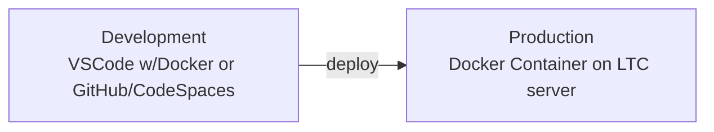

# Task Overview

In this project, you'll set up a dedicated environment to host the websites you create throughout this course. This will be done using Docker, a powerful tool that allows you to run multiple isolated servers (called containers) on a single machine.

Docker containers are lightweight and efficient, and they provide a consistent and portable way to run your websites. This means you can easily share your websites with others and deploy them on different platforms without worrying about compatibility issues.

You will be building an individual docker 'server' and documenting the process.

During the remainder of the course, you will be developing the sites and then deploying to the Docker container you develop here.

# Project Details

| Estimated Hours | Deliverables            | Related Project (if applicable) |
| --------------- | ----------------------- | ------------------------------- |
| 2               | 1) Docker Container  | Remainder of Practical Projects |

## Competencies

| Unit Code      | Unit Title                                  | Cert II Core | Cert II Elective | Cert III Core | Cert III Elective |
| -------------- | ------------------------------------------- | :----------: | :--------------: | :-----------: | :---------------: |
| ICTICT213	  | Use computer operating systems and hardware |      ✅       |                  |               |         ✅         |

# Task

## Docker

**What is Docker?**

Imagine you have a computer with a lot of different programs installed on it, like a word processor, a web browser, and a music player. Each of these programs needs its own set of files and resources to run properly. If you try to run too many programs at the same time, your computer can start to slow down or even crash.

Docker is a tool that allows you to run multiple programs in isolated environments called containers. Each container has its own set of files and resources, so they don't interfere with each other or with your other software.

Docker containers are lightweight and efficient, so they don't take up a lot of space or resources on your computer. They're also portable, so you can easily move them between different machines and platforms.

**Why use Docker?**

There are many benefits to using Docker, including:

- **Isolation:** Docker containers are isolated from each other, so they won't interfere with each other or with your other software. This makes it easier to develop and test different programs without worrying about compatibility issues.
- **Consistency:** Docker containers provide a consistent environment for running your programs, regardless of the underlying operating system or hardware. This makes it easier to deploy your programs on different machines and platforms.
- **Portability:** Docker containers can be easily moved between different machines and platforms, making it easy to share and deploy your programs.

**How does Docker work?**

Docker uses a technology called virtualization to create isolated containers. Virtualization allows you to run multiple operating systems and applications on a single physical machine.

When you create a Docker container, you specify the operating system and software that you want to run inside the container. Docker then creates a virtual environment for the container, complete with its own files, resources, and network configuration.

**Who uses Docker?**

Docker is used by a wide variety of organizations, including:

- **Developers:** Docker makes it easier for developers to develop, test, and deploy their applications.
- **System administrators:** Docker can be used to manage and deploy complex systems and applications.
- **DevOps teams:** Docker helps DevOps teams to automate and streamline their software development and deployment processes.

**Is Docker right for me?**

If you're a high school student who is interested in learning more about software development, Docker is a great tool to get started with. Docker is easy to learn and use, and it can help you to develop and deploy your applications more efficiently.
