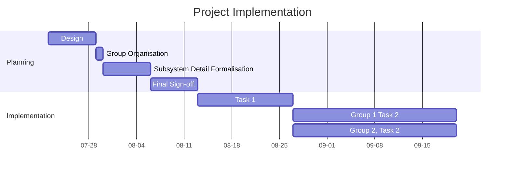
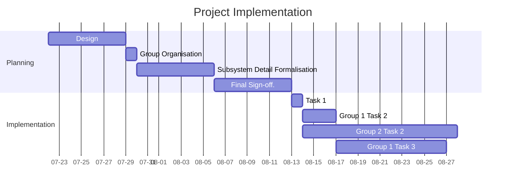

> [!important] View the assessment on Google Classroom for specific details.

# Technical Report

For suggestions on how to structure your report, see this page:

[Technical Report Writing](_sharedContent/technicalReportWriting.md)

# Assessable Topics 

These are the details you are to cover in the topics in Assessment 2. More Specific Details will be added later in the document.

## Project Overview

### Project Introduction

For this section, you should introduce the whole project, not just the coding requirements, but also the time management and project management. 

Time management could include:
- weeks involved
- how the tasks were organised into the different stages etc.

Project Management could focus on:
- How GitHub was used.

### Requirements

In this part detail and analyse the hardware **and** software requirements for the project.

### Intended Outcomes

Analyse what the outcomes of the project were, focusing on the end-user experience.

### Purpose

In this part, focus on the purpose of the project (not just the end product). For instance what learning outcomes could come from project etc.

## Code

In this section, focus **only on the aspect identified**. 

Analyse the code, and explain how that code operates and the purpose of each block of code. You should also analyse how this code interacts with other sub-systems within the project.

> [!tip] You **don't** need to explain every single line of code.

Pick a complex route and analyse that to demonstrate an understanding of the whole script.

**Web Dev Example**

Your goal for this section is to prove that you can analyse all the code through the analysis of one route.

Include a diagram to explain the overall code base (`app.py`, `models.py`, `forms.py`, templates etc). One diagram you could include how `app.py` fits into the larger picture of the structure of a flask project, and the interactions of `app.py` with the other modules in the project.

Pick one route, preferably a complex route, and analyse that one. For example `resumeBuild` (there may be a more suitable option however):

In this route, you could analyse
- what a `POST` and a `GET` request is, and how that links with `if request.method == 'POST'`
- How the route links to the flask framework and a URL in the browser.
- specific lines such as `resume_details = ResumeExperience.query.filter_by(userID=current_user.id).all()` and how that interacts with the database
- How the `new_resume=` and `new=referee` lines of code create new objects.
- Why each `if` block includes `db.session.add()` and `db.session.commmit()` code. Could there be a better way of doing it?
- What `return redirect()` and `return render_template()` statements do.

> [!tip] There could be much more for you to analyse. This is just a short list.

All of these topics will require further research - and references.

## Data

Focus on how data is transmitted within the project from one sub-system to another, within the focus given in the assessment documentation.

## Development Process

![[_sharedContent/Assessments2024S2/Task 2#Development Process|Task 2]]

## Technical Analysis

TBA

## Work Skills

In this section, concentrate on the stages of project implementation.  Following on from the small time management section within the Project Overview, show more detail regarding the implementation process. 

Critically, this section should focus on the **planned** vs **actual** implementation. You could also include a plan for implementation if you were going to start the same or similar project, using your experience to be more efficient - this could cover some or all of the critical analysis level of the rubric.

You could display this information (as evidence) as a *Gantt chart*. 

Present the two Gantt charts, as shown below, and then analyse the changes or differences and why the changes occurred. You could look at the GitHub repository history to see how the project was actually implemented.

**Proposed Implementation**

**Actual Implementation**

