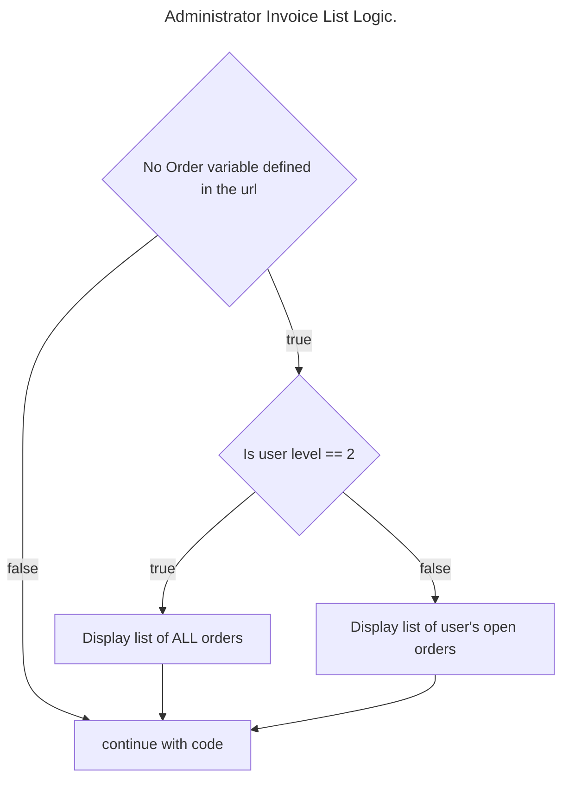

# User Registration

To begin the process of User Management, the user will need to be able to register an account.

Create a new file - `register.php` and replace the contents with the starting code.

```php
<?php include "template.php";
/**  @var $conn */
?>
	<title>User Registration</title>
	<h1 class='text-primary'>User Registration</h1>

	<!-- Front End -->
	<form action="<?php echo htmlspecialchars($_SERVER["PHP_SELF"]); ?>" method="post" enctype="multipart/form-data">
		<div class="container-fluid">
			<div class="row">
				<!--Customer Details-->

				<div class="col-md-6">
					<h2>Account Details</h2>
					<p>Please enter wanted username and password:</p>
					<p>Email Address<input type="text" name="username" class="form-control" required="required"></p>
					<p>Password<input type="password" name="password" class="form-control" required="required"></p>

				</div>
				<div class="col-md-6">
					<h2>More Details</h2>
					<!--Product List-->
					<p>Please enter More Personal Details:</p>
					<p>First Name<input type="text" name="firstName" class="form-control" required="required"></p>
					<p>Second Name<input type="text" name="secondName" class="form-control" required="required"></p>
					<p>Address<input type="text" name="address" class="form-control" required="required"></p>
					<p>Phone Number<input type="text" name="phoneNumber" class="form-control" required="required"></p>
				</div>
			</div>
		</div>
		<input type="submit" name="formSubmit" value="Submit">
	</form>
```

Add the link to the navbar.

![[userRegistrationNavigation.png]]

```php
<li class="nav-item">
	<a class="nav-link" href="register.php">Register</a>
</li>
```

Back on `register.php` add a PHP block to the end of the file and collect (and sanitise) the data the user entered.

![[userRegistationSanitiseInput.png]]

```php
<?php
// Back End
if ($_SERVER["REQUEST_METHOD"] == "POST") {
		$username = sanitiseData($_POST['username']);
	$password = sanitiseData($_POST['password']);
	$firstName = sanitiseData($_POST['firstName']);
	$secondName = sanitiseData($_POST['secondName']);
	$address = sanitiseData($_POST['address']);
	$phoneNumber = sanitiseData($_POST['phoneNumber']);
}
?>
```

Search the database to discover if the username entered by the user already exists.


> [!important] Make sure the table name matches your database (shown in blue) and the field matches as well (shown in red)
> 
![[userRegistrationSQLMatches.png]]

```php
$query = $conn->query("SELECT COUNT(*) FROM Customers WHERE EmailAddress='$username'");
```

Retrieve the count of usernames that match (if any).

Check if the `numberOfUsers` is greater than 0. This means that the username already exists.

```php
$data = $query->fetchArray();
$numberOfUsers = (int)$data[0];

if ($numberOfUsers > 0) {  // username already exists.
	echo "Sorry, that username already exists";
}
```

If `numberOfUsers` is 0 that means the username doesn’t already exist. Add an `else` clause and then hash the password.

![[userRegistrationCountUsers.png]]

```php
$hashedPassword = password_hash($password, PASSWORD_DEFAULT);
```

Create the SQL to insert the data into the database.

![[userRegistrationInsertUserData.png]]

```php
$sqlStmt = $conn->prepare("INSERT INTO Customers (EmailAddress, HashedPassword, FirstName, SecondName, Address, PhoneNumber) VALUES (:EmailAddress, :HashedPassword, :FirstName, :SecondName, :Address, :PhoneNumber)");
$sqlStmt->bindParam(':EmailAddress', $username);
$sqlStmt->bindParam(':HashedPassword', $hashedPassword);
$sqlStmt->bindParam(':FirstName', $firstName);
$sqlStmt->bindParam(':SecondName', $secondName);
$sqlStmt->bindParam(':Address', $address);
$sqlStmt->bindParam(':PhoneNumber', $phoneNumber);
$sqlStmt->execute();
```

Run the page in the browser and register an account! You can view the database to see if it works.

![[userRegistrationSuccess.png]]

![[commonBlocks#Commit & Push]]

# Session Variables

> [!info] PHP sessions are a way for a website to remember information about a user as they interact with the website.

PHP sessions are a way for a web server to store and maintain information about a user's interaction with a website across multiple requests. Sessions are used to store user-specific data, such as login credentials, shopping cart contents, or user preferences, so that this data can be accessed by the server on subsequent requests.

When a user visits a website, the server generates a unique session ID and sends it to the client's browser in the form of a cookie or as part of the URL. The browser sends this session ID back to the server with each subsequent request, allowing the server to identify the user and retrieve their session data.

PHP provides a built-in session handling mechanism that makes it easy to create and manage sessions in web applications. The **`session_start()`** function is used to start a new session or resume an existing one, and the **`$_SESSION`** superglobal array is used to store and retrieve session data.

Here's a basic example of how sessions can be used in PHP:

```php
// start or resume a session
session_start();

// store data in the session
$_SESSION['username'] = 'johndoe';
$_SESSION['cart'] = array('item1', 'item2', 'item3');

// retrieve data from the session
$username = $_SESSION['username'];
$cart = $_SESSION['cart'];
```

In this example, we start a new session using **`session_start()`**, and then store some data (a username and a shopping cart) in the **`$_SESSION`** array. On subsequent requests, we can retrieve this data from the **`$_SESSION`** array and use it as needed.

It's important to note that sessions are not a secure way to store sensitive data such as passwords or credit card numbers. Session data can be easily tampered with or stolen, so it's important to use encryption and other security measures to protect sensitive information.


> [!info] OpenAI's ChatGPT AI language model, personal communication, 31/3/23


## More Information

Introduction and Code examples

[PHP Sessions](https://www.w3schools.com/php/php_sessions.asp)

# User Login

To handle the login process, a login script will be created, however this won’t be used to display any HTML. This will allow the login process to occur on any page that you wish in the future.


> [!info] This script needs to process 2 cases:
1. The user entered a correct username and password combination
2. The user did **not** enter a correct username and password combination.


## Login Script

Create a new file in the root of your project called `login.php`. 

![[userLoginNewFile.png]]

**Replace** the default contents of the file with the following

| Line  | Description                                                                                                                      |
| ----- | -------------------------------------------------------------------------------------------------------------------------------- |
| 2     | Identifies `$conn` as a variable declared in another script.                                                                     |
| 4     | Checks to see if `login` is set. This in effect checks to see if the user has pressed the **login** button (to be created later) |
| 5 & 6 | Collects and sanitises the data entered in the `username` and `password` text boxes.                                             |


![[userLoginSanitiseInput.png]]

```php
<?php
/**  @var $conn */

if (isset($_POST['login'])) {
	$username = sanitiseData($_POST['username']);
	$password = sanitiseData($_POST['password']);

?>
```

Run a SQL query on the database which will return a count of all the users with the username entered by the user - `COUNT(*) as count`. Including the `as count` means that you can later use ‘count’ later in the SQL (such as on line 11).


> [!info] Remember that the table and fields needs to match **your** database.


![[userLoginSQL.png]]

```php
$query = $conn->query("SELECT COUNT(*) as count, * FROM Customers WHERE `EmailAddress`='$username'");
$row = $query->fetchArray();
$count = $row['count'];
```

If `$count` is above 0, this means that the username exists in the database. This is an important first step to determine if the user can login. If the username isn’t found, you do not want the user to login!

![[userLoginRowCount.png]]

```php
if ($count > 0) {

}
```

After confirming the username exists, the next step is to compare the password entered by the user to the hashed version of the password in the database. PHP provides a helper function for this - `password_verify(cleartext password, hashed password)` . If this returns `true` then the passwords match.


> [!info] Ensure that the field name matches the database you’re using.


![[userLoginPasswordVerify.png]]

```php
if (password_verify($password, $row['HashedPassword'])) {

}
```

At this stage, the username is found and the password matches the one stored in the database. The user can now log in! 

To do this in PHP, set the **session variables** that are required for your project. The session variables can be anything that is needed/wanted to meet the projects goals. 

In this case, two session variables are being set - `FirstName` and `EmailAddress` - and they are being assigned the values taken from the SQL query above.

`header("location:index.php");` is the PHP code required to redirect the browser to a new page - i.e. after the user logs in, load the `index.php` page.


> [!info] So far, this script handles Case 1 from above.


![[userLoginAssignSessionVariables.png]]

```php
$_SESSION["FirstName"] = $row['FirstName'];
$_SESSION['EmailAddress'] = $row['EmailAddress'];
header("location:index.php");
```

Regardless of whether the username or password is incorrect, the output should be the same - invalid username or password. 

For **both** if statements shown, include an `else` block to output the error to the user.

![[userLoginFailedConditions.png]]

```php
else {
	echo "<div class='alert alert-danger'>Invalid username or password</div>";
	}
} else {
	echo "<div class='alert alert-danger'>Invalid username or password</div>";
}
```

![[commonBlocks#Commit & Push]]

# Index

As the site’s front page is underused at this stage of development, this page will be used to link with the login script. Eventually the front page will appear similar to this.

![[indexEndResult.png]]

Open `index.php.`

Alongside including `template.php`, also include `login.php` to utilise the script created in that file.

![[indexInclude.png]]

```php
<?php include 'login.php'; ?>
```

Change the heading to indicate the shop name or products to be sold.

Change the text between the `<h1>` and `</h1>` tags.

![[indexHeading.png]]

```html
<h1>Star Wars Shopfront</h1>
```

Using bootstraps container layout options, create a container that will resize based on the width of the window (`container-fluid`) with 1 row of equal sized columns.

In bootstrap, each container is divided into 12 ‘columns’. In the example shown, the two columns set up uses the class `col-6` meaning that the column will take up half the width of that container.

![[indexLayout.png]]

```html
<div class="container-fluid">
	<div class="row">
		<div class="col-6">
			Column 1
		</div>
		<div class="col-6">
			Column 2
		</div>
	</div>
</div>
```

At this stage, the page renders as such:

![[indexLayoutColumns.png]]

Replace **Column 1** with details of your user accounts. This will make it easier to remember the username and password in the future.


> [!info] Change the username and passwords to the account that you created.


```php
<p>username: ryan.cather@ed.act.edu.au</p>
<p>Password: password</p>
<p>username: admin@admin.com</p>
<p>Password: admin</p>
```

**Column 2** will hold the form for the login process. 

Initially, replace Column 2 with a PHP if statement to check to see if the user is already logged in. This is done by using `isset($_SESSION["EmailAddress"])` which returns `true` if the variable has been set. However, the code wants to check if that variable has **not** been set. The way to do that is to ‘flip’ the response from the function so that it changes the response to the opposite. 

i.e. 

`true` → `false`, and

`false` → `true`.

In effect, this if statements run the code in the brackets if the session variable hasn’t been set.

![[indexCheckIfLoggedIn.png]]

```php
<?php if (!isset($_SESSION["EmailAddress"])) : ?>

<?php endif; ?>
```

If the user is not logged in, display the login form.

You’ll notice that the button name is `login` and this must match the code in `login.php` where it checks:

```php
if (isset($_POST['login']))
```

So the `login` must match on both pages!

![[indexLoginButton.png]]

```php
<form action="<?php echo htmlspecialchars($_SERVER["PHP_SELF"]); ?>" method="POST">
	<div class="form-group">
		<label>Username</label>
		<input type="text" name="username" class="form-control" required="required"/>
	</div>
	<div class="form-group">
		<label>Password</label>
		<input type="password" name="password" class="form-control" required="required"/>
	</div>

	<div class="text-center">
		<button name="login" class="btn btn-primary">Login</button>
	</div>
</form>
```

The home page of the site should now appear similar to this:

![[indexFinal.png]]


![[commonBlocks#Commit & Push]]

# Context Sensitive Navbar

At this stage of development, the navbar is standard across all pages (that include `template.php`), showing all the same links.

![[navStatic.png]]

With users now being able to login and out, it’s possible to utilise the session variables to change the options shown to the user. For instance, if the user is logged in, there’s no need for the **Register** link to be visible.

At this stage, depending on the users state (logged in or unregistered), the following links should be visible. 

| Anonymous | Logged in |
| --- | --- |
| Home (index) | Order Form |
| Contact Us | Invoice List |
| Register | Log Out |


> [!info] Later in development, an ‘administrator’ level user will be implemented which will have access to certain pages as well.


Open `template.php`.

First, to utilise the session variables in `template.php` add the following code block to the top of the file.

![[navStartSession.png]]

```php
<?php session_start(); ?>
```

Modify the list of nav bar items to check if the FirstName session variable is  set. If it is, then display the Order Form and Invoice List navbar items.

If the session varaible is not set, then show the Register navbar item.

![[navContextSensitiveLinks.png]]

```php
<?php
if (isset($_SESSION["FirstName"])) {
	echo '<li class="nav-item" ><a class="nav-link" href = "orderForm.php"> Order Form </a ></li >';
	echo '<li class="nav-item" ><a class="nav-link" href = "invoiceList.php"> Invoice list</a ></li >';
} else {
	echo '<li class="nav-item"><a class="nav-link" href="register.php">Register</a></li>';
}
?>
```

Finally, after the navbar items, on the left hand side of the navbar, add another check if the FirstName session variable is set, and if so, display a Welcome message, and the log out link.

![[navWelcome.png]]

```php
<?php
if (isset($_SESSION["FirstName"])) {
	echo '<div class="bg-light">Welcome, ' . $_SESSION["FirstName"] . '!<a class="nav-link" href="logout.php">Logout</a></div>';
}
?>
```

Once complete, the functionality should appear as shown.

![[navContextSensitive.gif]]

# User Logout

Create a new page - `logout.php`.

Luckily, this page doesn’t need much - all that is required is to clear all session variables defined by other pages (such as `login.php` etc). 

Replace the contents of `logout.php` with the code shown.

![[userLogoutNewPage.png]]

```php
<?php
session_start();
session_destroy();
header("Location:index.php");
?>

</body>
</html>
```

Try it out - load the site login, and then log out. Check the navbar to confirm that user is now logged out.

![[commonBlocks#Commit & Push]]

# Administrator Access

In order to add Administrator functionality, a simple modification that can be implemented is by adding an `AccessLevel` field in the Customer table. As developers you have the choice of how this is managed, i.e. this field could be TEXT with the words “Administrator” or “Regular User” stored. Alternatively, using numbers to denote access level could be used. For instance:

| AccessLevel field | User Level |
| --- | --- |
| 1 | Administrator |
| 2 | Regular User |

Add a new field in the Customer table called `AccessLevel`, with `integer` as the type.

Once created update the fields so that there is at least one administrator and one regular user in the system. Make sure you Submit the changes back to the database by pressing the Submit button.

![[userLevelNewField.png]]

## Modify `login.php`

When the user successfully authenticates, set the `AccessLevel` session variable to the value stored in the database for that user.

![[userLevelSessionVariable.png]]

```php
$_SESSION['AccessLevel'] = $row['AccessLevel'];
```


## Navbar changes

In preparation of the coming changes, the navbar needs to be updated to link to the new pages created.

Open `template.php` and add a new section for the Product Management section. 

This can be done in a number of ways, however as this section all relate to the Products, it may make sense to collect all the links in a single dropdown.

![[userLevelNavigationDropDown.png]]

Look for the section of the code where the navbar loads different links depending on whether the user is logged in or not (`if (isset($_SESSION["FirstName"])) {`)

Add the code to show a dropdown list of the links required, however only where the user is an administrator. 


> [!info] The AccessLevel session variable will be implemented in another section of the tutorial.


![[userLevelNavigation.png]]

```php
if (isset($_SESSION["AccessLevel"])) {
	if ($_SESSION["AccessLevel"] == 1) {
		?>
		<li class="nav-item dropdown">
			<a class="nav-link dropdown-toggle" href="#" role="button" data-bs-toggle="dropdown"
			   aria-expanded="false">
				Product Management
			</a>
			<ul class="dropdown-menu">
				<li><a class="dropdown-item" href="productAdd.php">Add Products</a></li>
				<li><a class="dropdown-item" href="productList.php">Product List</a></li>
			</ul>
		</li>
		<?php
	}
}

?>
```

# Project Updates

## Database Modification

To prepare for the functionality required by the Product Administration, and further functionality, make the following medications to the Products table.

![[projectUpdatesDBProducts.png]]

## Images folder

To store the product images, you will need to first create the folder to store them. 

In the main directory, create (if not already created) a directory called `images`. Inside that, create a directory called `productImages`.

![[projectUpdatesImagesFolder.png]]

# Add Products


> [!info] This functionality is very similar to the user registration process, with a few notable differences:

1. Products have a category
2. The choice for categories can be pulled from the database.
3. Images can be uploaded and stored for each product.
4. Only administrators can add products


Create a new PHP page in the main directory of the project called `productAdd.php`.  Replace the default contents of the page with the code shown.

![[addProductsNewPage.png]]

```php
<?php include "template.php";
/**  @var $conn */
?>
	<title>Add Products</title>
	<h1 class='text-primary'>Add Products</h1>
```

## Check permissions

Before allowing access to the form to create a new product, first check the user is an administrator through the `AccessLevel` session variable.

Add this code after the `Add Products` heading.

![[addProductsCheckPermission.png]]

```php
<!-- Front End -->

<?php
// Check to see if User is Administrator (level 1)
// If they are, allow functionality, otherwise redirect them back to the front page.
if ($_SESSION['AccessLevel'] == 1) {
	?>

	<?php
} else {
	header("location:index.php");
}
?>
```

## Front End

The Product Add page should have a consistent appearance to the registration page, except with the specific fields required. So for instance, the page could appear as:

![[addProductsFrontEndUpdates.png]]

To achieve this, the code would be as follows. Add this code within the permissions check code.

![[addProductsFrontEndForm.png]]

```php
<form action="<?php echo htmlspecialchars($_SERVER["PHP_SELF"]); ?>" method="post" enctype="multipart/form-data">
	<div class="container-fluid">
		<div class="row">
			<!--Customer Details-->

			<div class="col-md-6">
				<h2>Products Details</h2>
				<p>Product Name<input type="text" name="prodName" class="form-control" required="required"></p>
				<p>Product Category
					<input type="text" name="prodCategory" class="form-control" required="required">
				</p>
				<p>Quantity<input type="number" name="prodQuantity" class="form-control" required="required"></p>
			</div>
			<div class="col-md-6">
				<h2>More Details</h2>
				<!--Product List-->
				<p>Price<input type="number" step="0.01" name="prodPrice" class="form-control" required="required">
				</p>
				<p>Product Code<input type="text" name="prodCode" class="form-control" required="required"></p>
				<p>Product Picture <input type="file" name="prodImage" class="form-control" required="required"></p>
			</div>
		</div>
	</div>
	<input type="submit" name="formSubmit" value="Submit">
</form>
```

## Back End Functionality

After the front end code, add a new PHP block to collect the fields required from the form. This is done in the same way as other forms on the website.

Additionally, check to see if the product code already exists in the database. This is done similarly as checking if the username already exists.

![[addProductsBackEndCollectFormData.png]]

```php
<?php
// Back End
if ($_SERVER["REQUEST_METHOD"] == "POST") {
//    Customer Details
	$prodName = sanitiseData($_POST['prodName']);
	$prodCategory = sanitiseData($_POST['prodCategory']);
	$prodQuantity = sanitiseData($_POST['prodQuantity']);
	$prodPrice = sanitiseData($_POST['prodPrice']);
	$prodCode = sanitiseData($_POST['prodCode']);

//check if product exists.
	$query = $conn->query("SELECT COUNT(*) FROM Products WHERE code='$prodCode'");
	$data = $query->fetchArray();
	$numberOfProducts = (int)$data[0];

	if ($numberOfProducts > 0) {
		echo "Sorry, product already taken";
	} else {
// Product Registration commences
}
}
```

### Image Upload

Uploading images is a little more complex than simply uploading text to store in the database. **Either** the image can be uploaded and stored in the database, or the image is uploaded and stored on the server in a directory and a filename is stored in the database.

The latter option is preferred as database systems are not generally designed to store large binary data such as images.

To prepare the uploading of the image, a number of items must be checked - that the file is the correct type and that it’s not exorbitantly large. To do so, once the Product Registration Commences section of the code has been reached, extract the necessary data for the image.

![[addProductsImageUpload.png]]

```php
// Image details
$file = $_FILES['prodImage'];
$fileName = $_FILES['prodImage']['name'];
$fileTmpName = $_FILES['prodImage']['tmp_name'];
$fileSize = $_FILES['prodImage']['size'];
$fileError = $_FILES['prodImage']['error'];
$fileType = $_FILES['prodImage']['type'];

// defining what type of file is allowed
// We separate the file, and obtain the file extension.
$fileExtension = explode('.', $fileName);
$fileActualExtension = strtolower(end($fileExtension));

$allowedExtensions = array('jpg', 'jpeg', 'png', 'pdf');
```

Once all the relevant information is collected or extracted, confirm that the file extension is allowed, there are no errors, and that the size of the file is under a pre-determined size. **In other words, that the file is ok to upload**.

![[addProductsImageFileExtensions.png]]

```php
//We ensure the extension is allowable
if (in_array($fileActualExtension, $allowedExtensions)) {
	if ($fileError === 0) {
		// File is smaller than arbitrary size
		if ($fileSize < 10000000000) {
			//file name is now a unique ID based on time with IMG- preceeding it, followed by the file type.
			$fileNameNew = uniqid('IMG-', True) . "." . $fileActualExtension;
			//upload location
			$fileDestination = 'images/productImages/' . $fileNameNew;
			// Upload file
			move_uploaded_file($fileTmpName, $fileDestination);
```

### Insert Data into Database

At this stage, the form data has been collected and sanitised, and the image has been uploaded. It’s now time to write to the database.

After the image has been uploaded, add the code to write to the database.


> [!info] This code also shows the `else` blocks for if any of the image checks fail.


![[addProductsInsertData.png]]

```php
// Write details to database
$sql = "INSERT INTO Products (ProductName, Category, Quantity, Price, Image, Code) VALUES (:newProdName, :newProdCategory, :newProdQuantity, :newProdPrice, :newProdImage, :newProdCode)";
$stmt = $conn->prepare($sql);
$stmt->bindValue(':newProdName', $prodName);
$stmt->bindValue(':newProdCategory', $prodCategory);
$stmt->bindValue(':newProdQuantity', $prodQuantity);
$stmt->bindValue(':newProdPrice', $prodPrice);
$stmt->bindValue(':newProdImage', $fileNameNew);
$stmt->bindValue(':newProdCode', $prodCode);
$stmt->execute();
header("location:index.php");
```

### Create Products!

Create a number of products, with a range of different categories and images! Find images that are free to use.

### Product Categories

After a number of product categories has been created, the page can be update to limit the user to only a set number of options for the category. 

To do so, add the following SQL to the top of the page.

This code will query the products table and create a list of all the unique categories in the table.

![[addProductsProductCategories.png]]

```php
<?php
$query = $conn->query("SELECT DISTINCT category FROM Products");
?>
```

Replace the input text box for the product category with a drop-down box (using the `select` tag in HTML) which dynamically fills in the list from the SQL query.

![[addProductsProductCategoriesDropDown.png]]

```php
<select name="prodCategory">
	<?php
	while ($row = $query->fetchArray()) {
		echo '<option>' . $row[0] . '</option>';
	}
	?>
</select>
```

# Edit Product Details

As with the majority of other sections of this project, this section could be achieved in a number of different approaches. The approach taken here is to create a page that will generate and display a list of all the current products in the `Products` table. An example of this is shown here.

![[editProductsPage.png]]

Developing this page will allow the shown **Edit** button to load the Edit page, by passing a unique identifier to the product. This means that developing the Edit page will be easier as it only displays and saves the product details that is needed.

Additionally, this page can be expanded in the future by adding a link to remove individual products.

## List of Products

Create a new page in the main directory of the project called `productList.php`. Replace the default code with the project’s default code for new pages.

![[editProductsProductListPage.png]]

```php
<?php include "template.php";
/**  @var $conn */
?>
	<title>Product List</title>

	<h1 class='text-primary'>Product List</h1>
```

Have the page load some of the fields from the Products table. 

**Important**

The fields needed are dependent on the requirements of the project. The fields retrieved and **the order** in which they are retrieved will be required in the next step. 

In the case shown, the fields `ProductName`, `Image` and `Code` are retrieved. 

Later in the code, each row will be organised in an array, with `ProductName` having the index 0, `Image` with the index 1 and `Code` with the index 2.

![[editProductsRetrieveProductList.png]]

```php
<?php
$productList = $conn->query("SELECT ProductName, Image, Code FROM Products");
?>
```

Before generating the list of products for the user, first check if the user is an administrator. This is done the same way as other pages on the site. 

![[editProductsCheckPermissions.png]]

```php
<?php
// Check to see if User is Administrator (level 1)
// If they are, allow functionality, otherwise redirect them back to the front page.
if ($_SESSION['AccessLevel'] == 1) {
	?>
	<!--  Display a list of the products  -->

	<?php
} else {
	header("location:index.php");
}
?>
```

Assuming the user is an administrator, create a container to display the information required. 

When developing the page there is no knowledge of how many entries will need to be displayed, so a loop is required. In this case a `while` loop is arguably most appropriate.

![[editProductsAdminLoop.png]]

```php
<div class="container-fluid">
		<?php
		while ($productData = $productList->fetchArray()) {
			?>
			<!-- Display each product as [Image] [ProductName] [Edit Link]-->
			<?php
		}
		?>
	</div>
```

For each product, create a row, and three columns. The columns should display:

1. The image (filename is stored in `$productData[1]`)
2. The Product Name - `$productData[0]`.
3. An Edit Link including the product’s Code - `$productData[2]`.

The Edit link includes a reference to the page `productEdit.php` which has not been created as yet. However, the link also includes a variable called `prodCode` which is passed to the `productEdit.php` page. 

The url generated by this code will appear similar to this:

`http://localhost:63342/SDF-PHP2023/productEdit.php?prodCode=M3478D`

The `prodCode` variable will be the code entered when the product is added to the table. 

This variable will be used by the `productEdit.php` page to load the specific product details required.

![[editProductsAdminLoopDetails.png]]

```php
<div class="row">
	<div class="col-md-2">
		<?php
		echo '';
		?>
	</div>
	<div class="col-md-4">
		<?php echo $productData[0]; ?>
	</div>
	<div class="col-md-2">
		<!--            edit button-->
		<a href="productEdit.php?prodCode=<?php echo $productData[2]; ?>">Edit</a>
	</div>
</div>
```

## Edit Product

Create the `productEdit.php` page in the main directory. Replace the default code with code to get the URL parameter `prodCode` and load the relevant record from the product table.

Then, extract all the fields into individual variables to display in the form.

![[editProductsIndividualPage.png]]

```php
<?php include "template.php";
/**  @var $conn */
?>
<title>Edit Product</title>
<?php

if (isset($_GET["prodCode"])) {
	$prodCode = $_GET["prodCode"];
		$query = $conn->query("SELECT DISTINCT category FROM Products");
} else {
	header("location:index.php");
}

$query = $conn->query("SELECT * FROM products WHERE code='$prodCode'");
$prodData = $query->fetchArray();
$prodName = $prodData[1];
$prodPrice = $prodData[2];
$prodCategory = $prodData[3];
$prodQuantity = $prodData[4];
$prodImage = $prodData[5];
?>

<h1 class='text-primary'>Edit Product - <?= $prodName ?></h1>
```

Include the code to first confirm the user is an administrator, otherwise redirect them back to the home page.

![[editProductsReturntoMain.png]]

```php
<?php
// Check to see if User is Administrator (level 1)
// If they are, allow functionality, otherwise redirect them back to the front page.
if ($_SESSION['AccessLevel'] == 1) {
	?>

	<?php
} else {
	header("location:index.php");
}
?>
```

The displayed form will be extremely similar as the form to collect the data to add products - in `productAdd.php` - however this form will also pre-populate the form input boxes with the existing data from the SQL query.

If the user **is** an administrator, display the form filling in the details for the product.


> [!info] You may notice that the only change made to the Product Add form is the inclusion of the `value` attribute for each input box and the image being displayed.


![[editProductsPrePopulateForm.png]]

```php
<form action="productEdit.php?prodCode=<?= $prodCode ?>" method="post" enctype="multipart/form-data">
	<div class="container-fluid">
		<div class="row">
			<!--Customer Details-->
			<div class="col-md-6">
				<h2>Products Details</h2>
				<p>Product Name<input type="text" name="prodName" class="form-control" required="required"
									  value="<?= $prodName ?>"></p>
				<p>Product Category
					<input type="text" name="prodCategory" class="form-control" required="required"
						   value="<?= $prodCategory ?>"></p>
				</p>
				<p>Quantity<input type="number" name="prodQuantity" class="form-control" required="required"
								  value="<?= $prodQuantity ?>"></p>
			</div>
			<div class="col-md-6">
				<h2>More Details</h2>
				<!--Product List-->
				<p>Price<input type="number" step="0.01" name="prodPrice" class="form-control" required="required"
							   value="<?= $prodPrice ?>">
				</p>
				<p>Product Code<input type="text" name="prodCode" class="form-control" required="required"
									  value="<?= $prodCode ?>"></p>
				<p>Product Picture
					' width='100' height='100'>
					<input type="file" name="prodImage" class="form-control" required="required"></p>
			</div>
		</div>
	</div>
	<input type="submit" name="formSubmit" value="Submit">
</form>
```

Once the form has been submitted, the code required to update the record in the database is extremely similar to the code to add a new record.

The primary difference is the SQL statement is an `UPDATE` query rather than an `INSERT` query.

```php
<?php
// Back End
if ($_SERVER["REQUEST_METHOD"] == "POST") {
//    Customer Details
	$newName = sanitiseData($_POST['prodName']);
	$newCategory = sanitiseData($_POST['prodCategory']);
	$newQuantity = sanitiseData($_POST['prodQuantity']);
	$newPrice = sanitiseData($_POST['prodPrice']);
	$newCode = sanitiseData($_POST['prodCode']);

	// Image details
	$file = $_FILES['prodImage'];
	$fileName = $_FILES['prodImage']['name'];
	$fileTmpName = $_FILES['prodImage']['tmp_name'];
	$fileSize = $_FILES['prodImage']['size'];
	$fileError = $_FILES['prodImage']['error'];
	$fileType = $_FILES['prodImage']['type'];

	// defining what type of file is allowed
	// We separate the file, and obtain the file extension.
	$fileExtension = explode('.', $fileName);
	$fileActualExtension = strtolower(end($fileExtension));

	$allowedExtensions = array('jpg', 'jpeg', 'png', 'pdf');

	//We ensure the extension is allowable
	if (in_array($fileActualExtension, $allowedExtensions)) {
		if ($fileError === 0) {
			// File is smaller than arbitrary size
			if ($fileSize < 10000000000) {
				//file name is now a unique ID based on time with IMG- preceeding it, followed by the file type.
				$fileNameNew = uniqid('IMG-', True) . "." . $fileActualExtension;
				//upload location
				$fileDestination = 'images/productImages/' . $fileNameNew;
				// Upload file
				move_uploaded_file($fileTmpName, $fileDestination);

				// Write details to database
				$sql = "UPDATE Products SET ProductName= :newProdName, Category= :newProdCategory, Quantity= :newProdQuantity, Price= :newProdPrice, Image= :newProdImage, Code= :newProdCode WHERE code='$prodCode'";
				$stmt = $conn->prepare($sql);
				$stmt->bindValue(':newProdName', $newName);
				$stmt->bindValue(':newProdCategory', $newCategory);
				$stmt->bindValue(':newProdQuantity', $newQuantity);
				$stmt->bindValue(':newProdPrice', $newPrice);
				$stmt->bindValue(':newProdImage', $fileNameNew);
				$stmt->bindValue(':newProdCode', $newCode);
				$stmt->execute();
				header("location:productList.php");
			} else {
				echo "Your image is too big!";
			}
		} else {
			echo "there was an error uploading your image!";
		}
	} else {
		echo "You cannot upload files of this type!";
	}
}

?>
```

The page should now allow an administrator to make changes to individual product details. Try it and ensure it works.

![[editProductsFinalView.png]]

# Remove Products

## Product List Update

Open`productList.php` page and add a new link to the page to remove the products.

![[removeProductLink.png]]

```php
<div class="col-md-2">
	<!-- remove button-->
	<a href="productRemove.php?prodCode=<?php echo $productData[2]; ?>">Remove</a>
</div>
```

## Product remove page

Create a new page `productRemove.php` in the root directory of the project. Replace the default contents with the project default code.

![[removeProductNewPage.png]]

```php
<?php include "template.php";
/**  @var $conn */
?>
<title>Remove Product</title>
```

Add the code block to only allow the functionality if the user is an administrator.

![[removeProductCheckPermissions.png]]

```php
<?php
// Check to see if User is Administrator (level 1)
// If they are, allow functionality, otherwise redirect them back to the front page.
if ($_SESSION['AccessLevel'] == 1) {
   

   
} else {
	header("location:index.php");
}
?>
```

Assuming the user is an administrator, the next step is to find the product code in the URL as a parameter.

![[removeProductAdminGetCode.png]]

```php
if (isset($_GET["prodCode"])) {
  // delete product from database
  $productToDelete = $_GET["prodCode"];
} else {
  echo "No product code found.";
}
```

Now assuming that the code is valid, then run a simple SQL query to remove the record from the table.


> [!info] This approach means that the product details will be completely removed from the database without being able to retrieve the data. Consider how this could be done differently to allow for a product to be ‘reinstated’ in the project.


![[removeProductAdminDeleteProduct.png]]

```php
$query = "DELETE FROM products WHERE code='$productToDelete'";
$sqlstmt = $conn->prepare($query);
$sqlstmt->execute();
echo "<p>Product " . $productToDelete . " has been deleted from the database";
```

## Test the functionality

Try adding a ‘dummy’ product into the system and then attempt to remove it through the newly created page.


# Project Overview

Open or create `design.md` in your project. Write a short description of the website, what the products are you’re going to sell etc. And a list of the functionality.

This is a markdown file, and as such you can indicate headings with #’s.

```markdown
# Heading 1
## Heading 2
### Heading 3
```

## Example

The markdown shown here will be rendered as indicated.

```markdown
# Project Overview

This PHP website will be an ecommerce site to sell handmade star wars memorabilia.

## User Management
Users will be able to login, log out, reset their passwords, and edit their details.

Users will need to store:
- Name
- DOB
- Hashed password
- Access Level (user vs Administrator)
- Status (active or disabled)
```

![[projectOverview.png]]


# Shopping Cart Overview

The shopping cart functionality, or subsystem, is broken up into two pages - `orderForm.php` and `cart.php`. The Order form is responsible for displaying the products, allowing the user to select items to purchase. The Cart page displays the selected item/s and calculates the sub totals and total, and allows the user to ‘make’ a purchase.

[Example](https://drive.google.com/file/d/1pcbU9X2vxiTqaxBkXhadTkw6CL3NHcSS/view?usp=drive_web)

# Order Form


> [!info] If there is already an `orderForm.php` page in your project, you can either delete all the contents, or rename the file to `orderform.old` or similar.


## Order Form CSS

Before creating the order form page, create a new **StyleSheet** file in the CSS folder. Call the file `orderForm.css`.

Copy replace the contents with the code shown.

![[orderFormCSS.png]]

```css
.product_wrapper {
	float:left;
	padding: 30px;
	text-align: center;
}
.product_wrapper:hover {
	box-shadow: 0 0 0 2px #e5e5e5;
	cursor:pointer;
}
.product_wrapper .name {
	font-weight:bold;
}
.product_wrapper .buy {
	text-transform: uppercase;
	background: #F68B1E;
	border: 1px solid #F68B1E;
	cursor: pointer;
	color: #fff;
	padding: 8px 40px;
	margin-top: 10px;
}
.product_wrapper .buy:hover {
	background: #f17e0a;
	border-color: #f17e0a;
}
.message_box .box{
	margin: 10px 0px;
	border: 1px solid #2b772e;
	text-align: center;
	font-weight: bold;
	color: #2b772e;
}
.table td {
	border-bottom: #F0F0F0 1px solid;
	padding: 10px;
}
.cart_div {
	float:right;
	font-weight:bold;
	position:relative;
	padding-right: 30px;
}
.cart_div a {
	color:#000;
}
.cart_div span {
	font-size: 12px;
	line-height: 14px;
	background: #F68B1E;
	padding: 2px;
	border: 2px solid #fff;
	border-radius: 50%;
	position: absolute;
	top: -1px;
	left: 13px;
	color: #fff;
	width: 20px;
	height: 20px;
	text-align: center;
}
.cart .remove {
	background: none;
	border: none;
	color: #0067ab;
	cursor: pointer;
	padding: 0px;
}
.cart .remove:hover {
	text-decoration:underline;
}
```

## Order Form PHP

Create a new PHP page in the project called `orderForm.php`. Replace the contents with the code as shown.

![[orderFormNewFile.png]]

```php
<title>Order Form</title>
<?php include "template.php";
/**  @var $conn */
?>
<link rel="stylesheet" href="css/orderForm.css">

<h1 class="text-primary">Order Form</h1>
```

The logic for the order form is relatively complex due to the dynamic nature of the product information as well as the CSS used to display it.

This will display a page similar to this.

![[orderFormFinalForm.png]]

![[orderFormCode.png]]

```php
<?php
$status = "";
if (isset($_POST['Code']) && $_POST['Code'] != "") {
	$code = $_POST['Code'];
	$row = $conn->querySingle("SELECT * FROM products WHERE code='$code'", true);
	$name = $row['ProductName'];
	$price = $row['Price'];
	$image = $row['Image'];
	$id = $row['ProductID'];

	$cartArray = array(
		$code => array(
			'id' => $id,
			'productName' => $name,
			'code' => $code,
			'price' => $price,
			'quantity' => 1,
			'image' => $image)
	);

	// Debug Purposes
	// echo '<pre>'; print_r($cartArray); echo '</pre>';

	if (empty($_SESSION["ShoppingCart"])) {
		$_SESSION["ShoppingCart"] = $cartArray;
		$status = "<div class='box'>Product is added to your cart!</div>";
	} else {
		$array_keys = array_keys($_SESSION["ShoppingCart"]);
		if (in_array($code, $array_keys)) {
			$status = "<div class='box' style='color:red;'>Product is already added to your cart!</div>";
		} else {
			$_SESSION["ShoppingCart"] = array_merge(
				$_SESSION["ShoppingCart"], $cartArray
			);
			$status = "<div class='box'>Product is added to your cart!</div>";
		}
	}
}
?>

<div class="message_box" style="margin:10px 0px;">
	<?php echo $status; ?>
</div>

<?php

if (!empty($_SESSION["ShoppingCart"])) {
	$cart_count = count(array_keys($_SESSION["ShoppingCart"]));
	?>
	<div class="cart_div">
		<a href="cart.php"> Cart<span>
<?php echo $cart_count; ?></span></a>
	</div>
	<?php
}

$result = $conn->query("SELECT * FROM Products");
while ($row = $result->fetchArray()) {
	echo "<div class='product_wrapper'>
	<form method ='post' action =''>
	<input type='hidden' name='Code' value=" . $row['Code'] . " />
	<div class='image'></div>
	<div class='name'>" . $row['ProductName'] . "</div>
	<div class='price'>$" . $row['Price'] . "</div>
	<button type='submit' class='buy'>Add to Cart</button>
	</form>
	</div>";
}

?>
```

## Update the Navbar

Open `template.php` and update the navbar to link to the Order Form. However, make sure the user is logged in before showing the link. If they aren’t logged in, display the registration link.

![[orderFormNavUpdate.png]]

```php
if (isset($_SESSION["FirstName"])) {
	echo '<li class="nav-item" ><a class="nav-link" href = "orderForm.php"> Order Form </a ></li >';
	echo '<li class="nav-item" ><a class="nav-link" href = "invoiceList.php"> Invoice list</a ></li >';
} else {
	echo '<li class="nav-item"><a class="nav-link" href="register.php">Register</a></li>';
}
```

# Shopping Cart


> [!info] Prerequisite: The Order Form has been completed.


Create a new file in the root directory of the project called `cart.php`. 

This page will be developed to load the contents of the `ShoppingCart` session variable and display the relevant details.

The page will also dynamically generate the sub totals for each product and the invoice total. When the user completes the order, the details are stored in the Order table.

![[cartNewFile.png]]

Replace the contents of the file with the code shown.

```php
<?php include "template.php";
/**
 * Shopping Cart.
 * Displays (and allows edits) of the items that the user has entered into their cart.
 * On submit, writes it to the orderDetails table.
 * Additionally, updates messaging table to send message to admin to indicates order has been made.
 *
 * "Defines" the conn variable, removing the undefined variable errors.
 * @var $conn
 */
?>
<title>Cart</title>

<link rel="stylesheet" href="css/orderForm.css">

<?php
// Debug Purposes
 //echo '<pre>'; print_r($_SESSION["ShoppingCart"]); echo '</pre>';

if (isset($_SESSION["FirstName"])) {
date_default_timezone_set("Australia/Sydney");
$status = "";
if (isset($_POST['action']) && $_POST['action'] == "remove") {
	if (!empty($_SESSION["ShoppingCart"])) {
		foreach ($_SESSION["ShoppingCart"] as $key => $value) {
			if ($_POST["code"] == $key) {
				unset($_SESSION["ShoppingCart"][$key]);
				$status = "<div class='box' style='color:red;'>Product is removed from your cart!</div>";
			}
			if (empty($_SESSION["ShoppingCart"]))
				unset($_SESSION["ShoppingCart"]);
		}
	}
}

//This code runs when the quantity changes for a row
if (isset($_POST['action']) && $_POST['action'] == "change") {
	foreach ($_SESSION["ShoppingCart"] as &$value) {
		if ($value['code'] === $_POST["code"]) {
			$value['quantity'] = $_POST["quantity"];
			break; // Stop the loop after we've found the product
		}
	}
}
?>

<div class="message_box" style="margin:10px 0px;">
	<?php echo $status; ?>
</div>

<div class="cart">
	<?php
	if (isset($_SESSION["ShoppingCart"])) {
	$total_price = 0;
	?>
	<div class="container-fluid">
		<div class="row">
			<div class="col-2"></div>
			<div class="col-2">ITEM NAME</div>
			<div class="col-2">QUANTITY</div>
			<div class="col-2">UNIT PRICE</div>
			<div class="col-2">ITEMS TOTAL</div>
		</div>
		<?php
		foreach ($_SESSION["ShoppingCart"] as $product) {
			?>
			<div class="row">
				<div class="col-2">
					' width="50" height="40"/>
				</div>
				<div class="col-2"><?php echo $product["productName"]; ?> <br>
					<form method='post' action=''>
					<input type='hidden' name='code' value="<?php echo $product["code"]; ?>"/>
					<input type='hidden' name='action' value="remove"/>
					<button type='submit' class='remove'>Remove Item</button>
					</form>
				</div>
				<div class="col-2">
					<form method='post' action=''>
						<input type='hidden' name='code' value="<?php echo $product["code"]; ?>"/>
						<input type='hidden' name='action' value="change"/>
						<select name='quantity' class='quantity' onChange="this.form.submit()">
							<option <?php if ($product["quantity"] == 1) echo "selected"; ?>
									value="1">1
							</option>
							<option <?php if ($product["quantity"] == 2) echo "selected"; ?>
									value="2">2
							</option>
							<option <?php if ($product["quantity"] == 3) echo "selected"; ?>
									value="3">3
							</option>
							<option <?php if ($product["quantity"] == 4) echo "selected"; ?>
									value="4">4
							</option>
							<option <?php if ($product["quantity"] == 5) echo "selected"; ?>
									value="5">5
							</option>
						</select>
					</form>
				</div>
				<div class="col-2">
					<!--Individual product price-->
					<?php echo "$" . $product["price"]; ?>
				</div>
				<div class="col-2">
					<!-- Subtotal for product-->
					<?php echo "$" . $product["price"] * $product["quantity"]; ?>
				</div>
			</div>
			<?php
			$total_price += ($product["price"] * $product["quantity"]);
		}
		?>
		<div class="row">
		<div class="col-12" align="right">
		<div class="badge bg-primary text-wrap fs-5">TOTAL: <?php echo "$". $total_price; ?></div>
</div>
</div>
	</div>
<form method="post">
			<input type="submit" name="orderProducts" value="Order Now"/>
		</form>
	<?php
}

	if(isset($_POST['orderProducts'])) {
		// Writing the order to the database
		$orderNumber = "ORDER" . substr(md5(uniqid(mt_rand(), true)), 0, 8);
		foreach ($_SESSION["ShoppingCart"] as $row) {
				$customerID = $_SESSION["CustomerID"];
				$productID = $row['id'];
				$quantity = $row['quantity'];
				$orderDate = date("Y-m-d h:i:sa");

				// Write to the Db.
				$conn->exec("INSERT INTO Orders (OrderNumber,CustomerID, ProductID, OrderDate, quantity) VALUES('$orderNumber','$customerID','$productID','$orderDate', '$quantity')");

			}
		$_SESSION["ShoppingCart"] = [];

	}
} else {
	header("Location:index.php");
}

?>
```


# Invoices

> [!info] Goal: The invoices page has a number of use cases to satisfy:

1. If user is not logged in, then redirect them to index.php
2. Users to view their "open" orders as a list.
3. Users to view invoices from individual orders (using the order variable in url, e.g `invoice.php?order=234`)
4. Inform users if they have not previously made any orders.
5. Administrators to view all orders
6. Administrators can OPEN and CLOSE orders

---

## Database Updates

In the Orders table, add a new column called Status with the default open as `OPEN`.

![[invoiceDBChanges.png]]

---

## Invoice.php

Create a new file called `invoice.php`. If there already is a file called this in your project, rename the existing one `invoice.php.old` or equivalent.

![[invoiceNewFile.png]]

Replace the contents with the code shown, including template.php and documenting the different cases the page has to cover.

![[invoiceComments.png]]

```php
<?php
include "template.php";
/*
 * The invoices page has a number of use cases to satisfy:
		1. If user is not logged in, then redirect them to index.php
		2. Users to view their "open" orders as a list.
		3. Users to view invoices from individual orders (using the order variable in url, e.g `invoice.php?order=234`)
		4. Inform users if they have not previously made any orders.
		5. Administrators to view all orders
		6. Administrators can OPEN and CLOSE orders

  @var $conn
 */
```

Check to see if the user is not logged in. If the user is not logged in, redirect them to the home page. 

This is done as a security measure as unauthorised users should not be able to access any invoice details.

![[invoiceGetCustomerID.png]]

```php
if (!isset($_SESSION["CustomerID"])) {
	// Case 1. The user is not logged in.
	header("Location:index.php");
}
```

Assuming the user is logged in, the page will then either produce a list of open orders (case 2) or display the details of a specific order (case 3).

Add a check to see if the order variable is found in the url. In other words, if the url appears similar to this:

`127.0.0.1/invoice.php`

or

`127.0.0.1/invoice.php?order=1234`

![[invoiceGetOrderNumber.png]]

```php
if (empty($_GET["order"])) {
	// Case 2 - no 'order' variable detected in the url.
} else {
	// Case 3 - 'order' variable detected. 
}
```

Focusing on Case 2, load all the orders from the database made by the user currently logged in.

![[invoiceRetrieveOrder.png]]

```php
$custID = $_SESSION['CustomerID'];
$query = $conn->query("SELECT OrderNumber FROM Orders WHERE CustomerID='$custID' AND Status='OPEN'");
$count = $conn->querySingle("SELECT OrderNumber FROM Orders WHERE customerID='$custID' AND status='OPEN'");
$orderCodesForUser = [];
```

Check $count. If this is greater than 0, then display the list of open orders (case 2).If the count is 0, this means that the current user does not have any open orders (Case 4). 

![[invoiceCustomerNoOrders.png]]

```php
if ($count > 0) {  // Has the User made orders previously?
	// Case 2: Display open orders

} else {
	// Case 4: No orders found for the logged in user.
	echo "<div class='badge bg-danger text-wrap fs-5'>You don't have any open orders. Please make an order to view them</div>";

}
```

**Case 4** Should appear similar to this.

![[invoiceCustomerNoOrdersOutput.png]]

Focusing on Case 2, get a list of the open orders in the table, and generate a unique list of the order numbers found.

![[invoiceListOpenOrders.png]]

```php
while ($data = $query->fetchArray()) {
	$orderCode = $data[0];
	array_push($orderCodesForUser, $orderCode);
}
//Gets the unique order numbers from the extracted table above.
$unique_orders = array_unique($orderCodesForUser);
```

For every unique order number, create a row in a container containing a link showing that order number. This link will load the invoice page again with the order number in the url, which will trigger Case 3.

```php
echo "<div class='container-fluid'>";
// Produce a list of links of the Orders for the user.
foreach ($unique_orders as $order_ID) {
	?>
	<div class='row'>
		<div class='col-12'><a href='invoice.php?order=<?= $order_ID ?>'>Order : <?= $order_ID ?></a></div>
	</div>
	<?php
}
echo "</div>";
```

**Case 2** The page should appear similar to this.

![[invoiceListOpenOrdersOutput.png]]

## Case 3 - Display Invoice

Case 3 involves displaying an individual invoice to the user. This assumes that the user has clicked through to view the list of open orders, and then selects one of them. The invoice is then displayed. A sample invoice could appear similar to this.

![[invoiceDisplayInvoice.png]]

Find where Case 3 is handled in the code (the `else` block for the `if (empty($_GET["order"]))` check).

The first step is to capture and store the order number from the url. Store the order number in a new variable called `$orderNumber`.

![[invoiceGetIndividualOrderNumber.png]]

```php
$orderNumber = $_GET["order"];
```

The next step is to extract the relevant information from the database relating to the order requested. This will involve a more complex SQL query than previously attempted due to requiring information from multiple tables.

You will need the following fields from the indicated tables.

| Field | Table |
| --- | --- |
| Product Name | Products |
| Price | Products |
| Quantity | Orders |
| Subtotal (Price * Quantity) | Products and Quantity |
| Order Date | Orders |
| Status | Orders |


> [!info] `Subtotal` is a calculated field which means that the Price and Quantity is multiplied together to calculate the result.


To achieve this in SQL, you will need to **JOIN** the tables in the query. 

The SQL for this query will be similar to this, with the specific order number dynamically applied through the `orderNumber` variable defined previously.

```sql
SELECT p.ProductName, p.Price, o.Quantity, p.Price * o.Quantity as SubTotal, o.OrderDate, o.Status
FROM Orders o
		 INNER JOIN Products p on o.ProductID = p.ProductID
WHERE o.OrderNumber = 'ORDERd1edade1'
```

Information on an INNER JOIN can be found here: 

[SQL INNER JOIN Keyword](https://www.w3schools.com/sql/sql_join_inner.asp)

![[invoiceRetrieveOrderDetails.png]]

```php
$query = $conn->query("SELECT p.ProductName, p.Price, o.Quantity, p.Price*o.Quantity as SubTotal, o.OrderDate, o.Status FROM Orders o INNER JOIN Products p on o.ProductID = p.ProductID WHERE o.OrderNumber='$orderNumber'");
```

Create a `$total` variable to store the running total of all the items.

![[invoiceDeclareTotalVariable.png]]

```php
$total = 0;
```

Create the Bootstrap grid layout to display the invoice information.


> [!info] You may see an error for `$orderDate` as this has not been defined as yet.


![[invoiceOutputCode.png]]

```php
?>
  <div class='container-fluid'>
  <div class='row'>
	  <div class='col text-success display-6'>Product Name</div>
	  <div class='col text-success display-6'>Price</div>
	  <div class='col text-success display-6'>Quantity</div>
	  <div class='col text-success display-6'>Subtotal</div>
  </div>

<!-- Invididual Rows here -->

  <div class='row'>
	  <div class='col'></div>
	  <div class='col'></div>
	  <div class='col display-6'>Total : $<?= $total ?></div>
  </div>
  <div class='row'>
	  <div class='col'></div>
	  <div class='col'></div>
	  <div class='col'><?= $orderDate ?></div>
  </div>

<?php
```

Replace the comment for Individual Rows with code to loop over each record of the SQL result. This loop will extract and store each field into individual variables, and then display the information in columns to match the structure created previously.

![[invoiceIndividualOrderLoop.png]]

```php
<?php
while ($data = $query->fetchArray()) {
	echo "<div class='row'>";
	$productName = $data["ProductName"];
	$price = $data["Price"];
	$quantity = $data["Quantity"];
	$subtotal = $data["SubTotal"];
	$orderDate = $data["OrderDate"];
	$status = $data["Status"];
	$total = $total + $subtotal; // Running Total
	echo "<div class='col'>" . $productName . "</div>";
	echo "<div class='col'>$" . $price . "</div>";
	echo "<div class='col'>" . $quantity . "</div>";
	echo "<div class='col'>$" . $subtotal . "</div>";

	echo "</div>";
}
?>
```

Save and open the page in a browser. Choose an open invoice and dynamically created invoice should appear.

## Cases 5 & 6 - Administrator Access

As yet, the invoices page does not cater for administrator control, defined by the users `AccessLevel` field in the database.  The page has the following administrator use cases:

*5. Administrators to view all orders*

*6. Administrators can OPEN and CLOSE orders*

### Case 5 Administrators to view all orders

Modifying the page to allow administrators to see all orders is a relatively simple fix. Assuming the `order` variable is not defined in the URL (case 2), the page displays a list of all the users open invoices. A check needs to be added in this logic - if the user is an administrator, create a list of all invoices, otherwise a list of all the users open invoices.



Create the if block to check if the `AccessLevel` session variable for the user is equal to 2 (they’re an administrator). 

If AccessLevel is not 2, then the SQL is the same as previously coded. Simply move the `$query` and `$count` SQL queries of code shown into the `else` block.

![[invoiceAdminRetrieveOrder.png]]

```php
if ($_SESSION["AccessLevel"] == 1) {
	// Case 5 - Generate a list of all invoices for administrators
} else {
	// Case 2 - Generate a list of open invoices for user
	$query = $conn->query("SELECT OrderNumber FROM Orders WHERE CustomerID='$custID' AND Status='OPEN'");
	$count = $conn->querySingle("SELECT OrderNumber FROM Orders WHERE customerID='$custID' AND status='OPEN'");
}
```

Add the `$query` and `$count`SQL queries to extract a list of all open orders for administrators.

![[invoiceAdminRetrieveAllOrders.png]]

```php
$query = $conn->query("SELECT OrderNumber FROM Orders");
$count = $conn->querySingle("SELECT OrderNumber FROM Orders");
```

Test the site, trying it as both a user with administrator access and one without.

## Opening and Closing Orders

Managing the ordering process is important and having administrators being able to mark orders as completed is useful. To achieve this, you’ll add a simple link which includes a new URL parameter for the status. If it’s `OPEN`, the link allows the administrator to close the order. If the status is `CLOSED` the link will allow the order to be reopened (set it to `OPEN`).

Start by looking at the end of the file for the start of the file and add a check to see if the status parameter is found in the url.

![[invoiceCheckPermissions.png]]

```php
if ($_SESSION["AccessLevel" == 1]) {
	if (!empty($_GET["status"])) {

	}
}
```

Assuming there is a status url parameter, which will be either `OPEN` or `CLOSED`.  Whichever it is, update the database by changing the status to the opposite - OPEN→CLOSED or CLOSED→OPEN.

![[invoiceAdminIfClosed.png]]

```php
if ($_GET["status"] == "CLOSED") {
	$conn->exec("UPDATE Orders SET status='CLOSED' WHERE OrderNumber='$orderNumber'");
	$orderMessage = "Order #:" . $orderNumber . " has been closed";
} else {
	$conn->exec("UPDATE Orders SET status='OPEN' WHERE OrderNumber='$orderNumber'");
	$orderMessage = "Order #:" . $orderNumber . " has been re-opened";
}
```

Finally, after the code to update the database, include the code to display a link to either Open or close the order, depending on the current status of the order.

![[invoiceAdminIfOpen.png]]

```php
$query=$conn->query("SELECT Status from Orders WHERE OrderNumber='$orderNumber'");
$data=$query->fetchArray();
$status=$data["Status"];

if ($status == "OPEN") {
	echo "STATUS: OPEN";
	echo "<p><a href='invoice.php?order=" . $orderNumber . "&status=CLOSED'>Click here to close</a></p>";
} else {
	echo "STATUS: CLOSED";
	echo "<p><a href='invoice.php?order=" . $orderNumber . "&status=OPEN'>Click here to open</a></p>";
}
```


# User Notifications

An important aspect to the user experience (UX) is giving appropriate feedback to users. Notifications need to inform the user of any errors that have occurred but also inform the user if something has occurred successfully if it may not be obvious otherwise (such as logging in).

[A Comprehensive Guide to Notification Design | Toptal®](https://www.toptal.com/designers/ux/notification-design)

Currently in the project there is minimal feedback to the user, although some has been implemented. One would be the use of the welcome message once the user has logged in. Another is when a product is added to the shopping cart etc.

## Notification Centre

To create a notification system, start by creating part of the website to display the messages. The best place would be to create this in the template.

Open `template.php` and find a position to include the notifications. In this example, it has been placed simply after the navbar is closed off.

This section of code will display any text that has been saved in the ‘`flash_message`’ session variable. It’s stored (line 62) in the `$message` variable, then the session variable is cleared (line 63).

The contents of `$message` is then displayed on the webpage (line 66).

![[flashMessagesCode.png]]

```php
<?php
if (isset($_SESSION['flash_message'])) {
	$message = $_SESSION['flash_message'];
	unset($_SESSION['flash_message']);
//    echo $message;
	?>
	<div class="position-absolute bottom-0 end-0">
		<?= $message ?>

	</div>

	<?php
}
?>
```

## Notifications

To notify the users of any errors or updates, you can simply assign the message to the flash message session variable. For example, with the login process, you may wish to notify the user that they’ve logged in successfully, and also notify them if the login with unsuccessful.

![[flashMessagesSessionVariableExample.png]]

```php
$_SESSION["flash_message"] = "<div class='bg-success'>Login Successful</div>";

$_SESSION["flash_message"] = "<div class='bg-danger'>Invalid Username or Password</div>";
```

![[flashMessagesExampleOutput.png]]

## Notification Colours

Notice the different classes in the example for the two messages - one uses `bg-success` and the other uses `bg-danger`. These are bootstrap classes to define the colour of the backgrounds of the div blocks.

The different classes available can be found here:

[Background](https://getbootstrap.com/docs/5.2/utilities/background/)

![[bootstrapColours.png]]

Update the other pages to notify the users of any updates to the system and/or errors. Some examples may be:

- The user has attempted to access a page they’re not authorised
- The user has successfully ordered products
- Orders have been opened or closed.
- Contact Us message has been successfully logged
- etc.