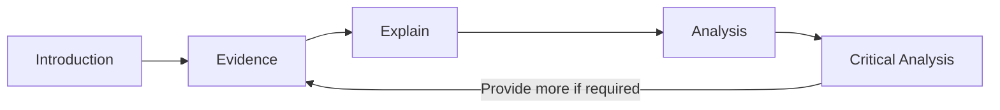
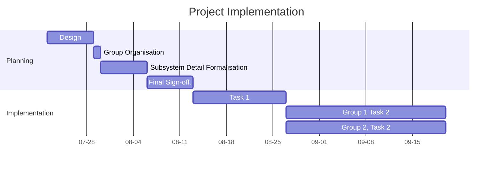
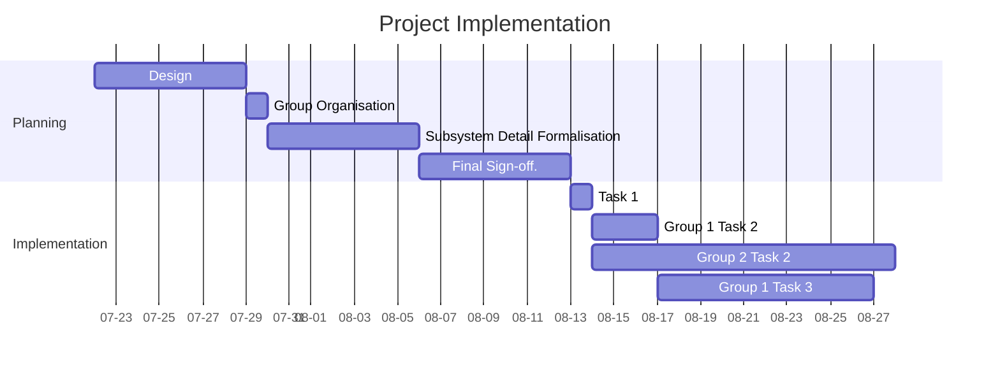

## Project Overview

### Project Introduction

For this section, you should introduce the whole project, not just the coding requirements, but also the time management and project management. 

Time management could include high-level analysis of:
- weeks involved
- how the tasks were organised into the different stages etc.

Project Management could focus on:
- How GitHub was used.

### Requirements

In this part detail and analyse the hardware **and** software requirements for the project.

### Intended Outcomes

Analyse what the outcomes of the project were, focusing on the end-user experience.

### Purpose

In this part, focus on the purpose of the project (not just the end product). For instance what learning outcomes could come from project etc.

## Code

In this section, focus **only on the aspect identified**. 

Analyse the code, and explain how that code operates and the purpose of each block of code. You should also analyse how this code interacts with other sub-systems within the project.

> [!tip] You **don't** need to explain every single line of code.

Pick a complex route and analyse that to demonstrate an understanding of the whole script.

## Data

Focus on how data is transmitted within the project from one sub-system to another, within the focus given in the assessment documentation.

## Development Process

This section should outline steps taken to complete the project in its entirety. While it doesn't need to be written in the order it was completed it can be helpful to think of it in this way:
- How were the steps of development implemented:
	- How were new additions created and implemented in the project
	- How do new additions fit into the grand scheme of the project?
	- How do new additions iterate on the project?
	- How did you test to make sure that these changes were implemented correctly?
	- Evaluate how this addition was implemented against other potential methodologies.

This should outline HOW the components of the project were developed and implemented. While it is helpful to think about how each step was individually created it is better to show a consistent and effective creation process.

Consider how changes and additions iterate on the project. The development process describes how all of the pieces of the project were created and how they come together to create the whole.

***Don't analyse the code as there is a section where you will show your ability to analyse code.***

The use of screenshots and diagrams is highly encouraged in order to show how the components of the project come together and how testing was done. For example you could include a diagram that illustrates how you new additions were implemented. You could also include screenshots of what the product (games, website, etc.) looks like after an example of implementation.

As an example this kind of description is a bare minimum starting point but it utilises a flow chart diagram of the development process very well:

If I was providing feedback on this development process I would be advising the student to include an example of how this process was applied in the creation of their project and asking for them to reflect upon alternative implementation tools/processes.

Once you have identified, described, and explained how the development process works in your project, choose and analyse how this process was used to create a component or two of your project.

Top level reports will evaluate the development process that was used against other potential alternatives (other coding languages, other auxiliary tools, other testing methods, other organisational structures, etc.)

## Technical Analysis

This section of the report should focus on a certain topic of the project. You may be required to analyse code, configurations or how components were developed, or different aspects, depending on the requirements of the section (see the assessment document).

The use of screenshots, videos, and diagrams is highly encouraged to convey complex information in an easily understood medium.

You may find the basic structure below to be beneficial to structuring your response.

This diagram indicates the steps involved, namely :
1. **Introduce** the topic required, 
2. Provide **Evidence** (screenshots, diagram, video etc)
3. **Explain** the importance of the evidence (or the part you wish to highlight)
4. Provide a technical **Analysis** of the evidence (e.g. deep-dive on technical aspects of evidence/topic), and finally
5. Compare or evaluate (provide a **Critical Analysis**) of the approach taken shown in the evidence against other approaches. 
6. Go back to step 2 and continue as needed.

## Work Skills

In this section, concentrate on the stages of project implementation.  Following on from the small time management section within the Project Overview, show more detail regarding the implementation process. 

Critically, this section should focus on the **planned** vs **actual** implementation. You could also include a plan for implementation if you were going to start the same or similar project, using your experience to be more efficient - this could cover some or all of the critical analysis level of the rubric.

You could display this information (as evidence) as a *Gantt chart*. 

Present the two Gantt charts, as shown below, and then analyse the changes or differences and why the changes occurred. You could look at the GitHub repository history to see how the project was actually implemented.

**Proposed Implementation**

**Actual Implementation**

