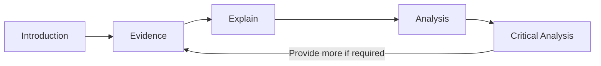
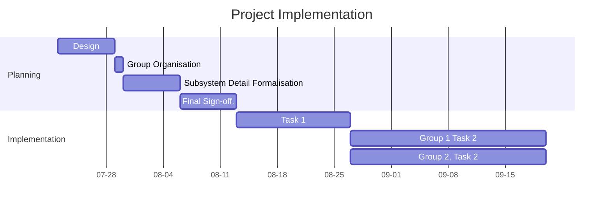
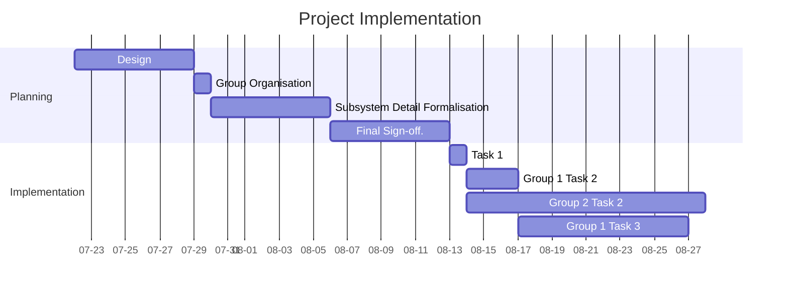

## Project Overview

### Project Introduction

For this section, you should introduce the whole project, not just the coding requirements, but also the time management and project management. 

Time management could include high-level analysis of:
- weeks involved
- how the tasks were organised into the different stages etc.

Project Management could focus on:
- How GitHub was used.

### Requirements

In this part detail and analyse the hardware **and** software requirements for the project.

### Intended Outcomes

Analyse what the outcomes of the project were, focusing on the end-user experience.

### Purpose

In this part, focus on the purpose of the project (not just the end product). For instance what learning outcomes could come from project etc.

## Code

In this section, focus **only on the aspect identified**. 

Analyse the code, and explain how that code operates and the purpose of each block of code. You should also analyse how this code interacts with other sub-systems within the project.

> [!tip] You **don't** need to explain every single line of code.

Pick a complex route and analyse that to demonstrate an understanding of the whole script.

## Data

Focus on how data is transmitted within the project from one sub-system to another, within the focus given in the assessment documentation.

## Development Process

- Brief 2-4 sentence summary for each week of what that week of development involved
	- What did you add to the Project?
	- How does your addition fit into the grand scheme of the project?
	- What new skills were required to make these additions?
	- Explain how previous learning and work contributed to your ability to complete this week or work.
<strong>Screenshots as evidence is always good</strong>
Remember this entire section is meant to amount to around 1000 words so if you have 10 weeks worth of development process those summaries either need to be combined or need to be ~100 words each.
This weekly summary may not work depending on your project. It may be worthwhile to use this scaffold to put into words what was done to complete the project. However, you may want to reorder or combine sections depending on how it will be best displayed. 

## Technical Analysis

This section of the report should focus on a certain topic of the project. You may be required to analyse code, configurations or how components were developed, or different aspects, depending on the requirements of the section (see the assessment document).

The use of screenshots, videos, and diagrams is highly encouraged to convey complex information in an easily understood medium.

You may find the basic structure below to be beneficial to structuring your response.

This diagram indicates the steps involved, namely :
1. **Introduce** the topic required, 
2. Provide **Evidence** (screenshots, diagram, video etc)
3. **Explain** the importance of the evidence (or the part you wish to highlight)
4. Provide a technical **Analysis** of the evidence (e.g. deep-dive on technical aspects of evidence/topic), and finally
5. Compare or evaluate (provide a **Critical Analysis**) of the approach taken shown in the evidence against other approaches. 
6. Go back to step 2 and continue as needed.

## Work Skills

In this section, concentrate on the stages of project implementation.  Following on from the small time management section within the Project Overview, show more detail regarding the implementation process. 

Critically, this section should focus on the **planned** vs **actual** implementation. You could also include a plan for implementation if you were going to start the same or similar project, using your experience to be more efficient - this could cover some or all of the critical analysis level of the rubric.

You could display this information (as evidence) as a *Gantt chart*. 

Present the two Gantt charts, as shown below, and then analyse the changes or differences and why the changes occurred. You could look at the GitHub repository history to see how the project was actually implemented.

**Proposed Implementation**

**Actual Implementation**

