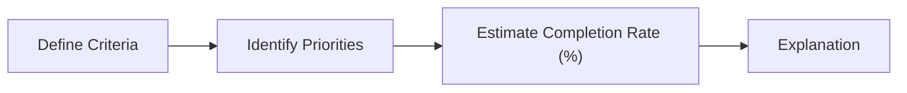

# Evaluation

Use the document supplied on Google Classroom. Fill in the document, following the steps defined below.

## Process

The overall Evaluation Process could be described as:

### Define Criteria

**Goal:** make a list of all the requirements for the project.

Include the list in the Document provided.

Some hints on where to start and what information to research:

- Consider the whole project - from start to finish.
- Re-read assessment documents.
- Re-read the project overview
- Consider software and hardware requirements
- Think back to the start of the project and throughout the life of the project.
- Look at project objectives, as well as technical (or other) constraints.

Think of each criteria with a heading and a short description.

<aside>
‼️ Include 2 columns for this. The Criteria category (like a title) and then the Requirements. The requirements list all the specifics for that criteria.

</aside>

**Examples**

| Criteria | Requirement/s |  |  |  |
| --- | --- | --- | --- | --- |
| Website Runs | The web site launches without error. |  |  |  |
| Software | Arduino IDE to be used. |  |  |  |
| Logo | The Logo appears in the correct position. |  |  |  |
| Navigation | Users can navigate between all high-level pages. |  |  |  |
| Administrator access | Only administrators can access restricted pages. |  |  |  |
| Access Control | If a non-administrator attempts to access restricted pages, the application will redirect them to a login page. |  |  |  |
| Temperature Threshold Configuration | Administrators can set the temperature threshold for the fan. |  |  |  |
| User Contact | When users click the Contact button, the application quits, and the tablet launches the web contact form. |  |  |  |

### Identify Priorities

For each of the criteria identified in the previous stage, assign the priority of that component to the project.

Start with a simple 3-level priority rating:

1 - High

2 - Medium

3 - Low

For instance, if the project was a website project, the Website Runs criteria would be 1 (High). Add this to the table created.

**Example**

| Criteria | Requirement/s | Priority |  |  |
| --- | --- | --- | --- | --- |
| Website Runs | The web site launches without error. | 1 |  |  |
| Software | Arduino IDE to be used. | 3 |  |  |
| Logo | The Logo appears in the correct position. | 1 |  |  |
| Navigation | Users can navigate between all high-level pages. | 2 |  |  |
| Administrator access | Only administrators can access restricted pages. | 1 |  |  |
| Access Control | If a non-administrator attempts to access restricted pages, the application will redirect them to a login page. | 3 |  |  |
| Temperature Threshold Configuration | Administrators can set the temperature threshold for the fan. | 3 |  |  |
| User Contact | When users click the Contact button, the application quits, and the tablet launches the web contact form. | 3 |  |  |

### Estimate Completion Rate (%)

Based on the requirements, how much was completed of that criteria? Use your judgement to estimate whether you completed it or not, and if not, how much was completed.

The priority rating system is flexible and you can define the parameters, how many priority levels there are etc. Make sure you include a key or legend to indicate the priority rating system you’ve implemented.

**Example**

| Priority | Value |
| --- | --- |
| High | 1 |
| Medium | 2 |
| Low | 3 |

| Criteria | Requirement/s | Priority | Estimate Completion % |  |
| --- | --- | --- | --- | --- |
| Website Runs | The web site launches without error. | 1 | 100% |  |
| Software | Arduino IDE to be used. | 3 | 100% |  |
| Logo | The Logo appears in the correct position. | 1 | 100% |  |
| Navigation | Users can navigate between all high-level pages. | 2 | 75% |  |
| Administrator access | Only administrators can access restricted pages. | 1 | 10% |  |
| Access Control | If a non-administrator attempts to access restricted pages, the application will redirect them to a login page. | 3 | 0% |  |
| Temperature Threshold Configuration | Administrators can set the temperature threshold for the fan. | 3 | 50% |  |
| User Contact | When users click the Contact button, the application quits, and the tablet launches the web contact form. | 3 | 95% |  |

### Explanation

In the final column provide insight for each criteria, with more focus on the ones uncompleted, or require additional research.

| Criteria | Requirement/s | Priority | Estimate Completion % | Explanation / Justification |
| --- | --- | --- | --- | --- |
| Website Runs | The web site launches without error. | 1 | 100% | Works without error. |
| Software | Arduino IDE to be used. | 3 | 100% | Works without error. Although other team members used Visual Studio Code with success with the Platform IO extensions - this may require further research to its effectiveness. |
| Logo | The Logo appears in the correct position. | 1 | 100% | Tested and appears on all pages. |
| Navigation | Users can navigate between all high-level pages. | 2 | 75% | Navigation works, however administrator pages are visible to unregistered users. |
| Administrator access | Only administrators can access restricted pages. | 1 | 10% | Pages are not restricted correctly on all pages. “Reset Password” page is restricted, however others are not.  |
| Access Control | If a non-administrator attempts to access restricted pages, the application will redirect them to a login page. | 3 | 0% | Not started due to time constraints. |
| Temperature Threshold Configuration | Administrators can set the temperature threshold for the fan. | 3 | 50% | Administrators can enter the values, and it is registered, however due to code organisation it is not possible to change the threshold without restarting the system at this stage. Further research is required. |
| User Contact | When users click the Contact button, the application quits, and the tablet launches the web contact form. | 3 | 95% | Tested and works without error on Android, however iOS 15 changed the underlying API and will require a OS Version check to be implemented.  |

### Completed Examples

<aside>
‼️ The format shown are just examples and do not need to be followed exactly.

</aside>

