# General

## Explanation

Modular programming is a software design technique that involves separating the functionality of a program into independent, interchangeable modules that can be used in different combinations to create multiple applications.

## Video

## Class Notes

[Presentation - Modularisation.pdf](Presentation_-_Modularisation.pdf)

## Summary

Modularisation is the process of splitting a large computer program into smaller, more manageable blocks of code. At this stage, the main structure for this process is called a **function.**

A function is a small subset of code which can be run (called) at different times during the execution of a program. The use of functions allow you to modularise your code to solve different, smaller problems in order to solve the overall problem.

## Functions

Functions are used to break the larger program into smaller, more manageable sections. This allows you, the developer, to focus on different parts of the program in different sections at different times.

Additionally, it can allow multiple developers to work on the same code base, but focusing on different functionality minimising interference. 

Functions allow you to reuse your functions in different parts of your code (and avoid repeating blocks of code), or in other programs, as well as provide you with a level of abstraction. 

> [!info] Functions can have many names. Depending on the context, they can be called **methods, modules, procedures** and many others.  They are all *functionally* the same, pun intended.

## Abstraction Example

Using the [top-down approach](https://www.notion.so/Computational-Thinking-16248ba104c84a14858882259cafe2f0?pvs=21), instead of writing down all the steps required for a task to be completed, you could focus on the higher level logic of the code, and identify the sections of the code to "farm out" to a function.

For instance, using the pancake analogy, you would first identify the higher level logic:

1. Buy ingredients
2. Cook Pancakes
3. Eat Pancakes

The implementation of (the details on how to complete) each of these stages would be a function. This is known as **abstraction.** 

> Abstraction is the process of identifying the overall logic (e.g. "buy ingredients") and ignoring the details (for now) of what that entails.
> 

Another example of abstraction

## DRY vs WET

![[_sharedContent/softwareDevFundamentals/_images/dryWet.png]]

Functions are one approach to reducing repeated code. Repeated code is undesirable in code as it can be harder to maintain (I.e. update and fix in the future) as the developer will have to change multiple parts of the code to solve one problem.

## Function Parameters / Arguments

Functions have three main parts to it (discussed later in [IPO Charts](Software%20Development%20Fundamentals%20Course%20Theory.md)), which can be simplified into Input, Processing, and Output. Some functions don't require any input to run, such as a function which loads a set file each time the program starts. However some functions require some form of input in order to start, such as a function to find the average of three numbers - the function requires the three numbers before it can calculate the result.

> [!info] Functions **do not** require input as a rule, but they all require processing and some form of output.

> [!info] Occasionally developers can use **parameters** and **arguments** interchangeably, but they are different. When the function is running, the variables defined in the function heading are called **parameters**. In the part of the code that calls the function, the data that is "sent" to the function is referred to as an **argument**.

### Parameter Example

This program calculates the GST component of the price of a product being sold.

The overall logic of the code is: 

- *Get the price of a product from the user, divide that price by 11, and tell the user the GST component of that price.*

The flowchart here shows that being done twice, and uses a function to calculate the GST and output it to the user.

You can see the flow of the logic here:

![[_sharedContent/softwareDevFundamentals/_images/parameterFlowchart.gif]]

## Return Data

Generally, data that is modified within a function is lost when the function completes - it goes out of scope. This is not *always* true, if you're using Global variables, however this should be minimised as much as possible. More accurately, any variables that are declared within a function are "forgotten" by the program when the function completes.

Fitting with the Input...Process...Output structure, functions **return** data, which is the output stage.

Functions *generally* need to specify the data type of the data being returned from the function. This can be referred to as the **return type**, or the **methods type.**

If a function doesn't return anything, the return type is **void** meaning nothing.

```mermaid
flowchart TD
subgraph calculateGST
terminalStartCalculateGST(["calculateGST(productPrice)"])
terminalEndCalculateGST(["Return GSTComponent"])
gstComponent["GSTComponent = productPrice / 11"]

terminalStartCalculateGST-->gstComponent
gstComponent-->terminalEndCalculateGST
end
subgraph Main
terminalStart([Start])
terminalEnd([End])
getPrice1[/productPrice=get price from user/]
getPrice2[/productPrice=get price from user/]
displayResult1[The GST Component of productPrice is GSTComponent]
displayResult2[The GST Component of productPrice is GSTComponent]
callGST1[["calculateGST(productPrice)"]]
callGST2[["calculateGST(productPrice)"]]

terminalStart-->getPrice1
getPrice1-->callGST1
callGST1-->displayResult1
displayResult1-->getPrice2
getPrice2-->callGST2
callGST2-->displayResult2
displayResult2-->terminalEnd
end

```

# Functions Design

These topics describe how you could/should consider when designing your functions.

## IPO Charts

One method to start designing function is to determine and document their Inputs (if any), what processing needs to occur and then what Outputs are needed (if any).

This can be done using an IPO (Input Process Output) Chart.

![[_sharedContent/softwareDevFundamentals/_images/ipoChart.jpeg]]

## Implementation Hiding

The concept of Implementation Hiding is used when deciding when and how functions are used. Importantly as well, is that the concept revolves around the remainder of the program not knowing, and not needing to know, how the implementation of the function is achieved. 

<aside>
‼️ Implementation Hiding is the concept of the low level details are "hidden" from the remainder of the program through a function call.

</aside>

Example:

Let's say you have an application developed which reads and writes data to a database. In testing, the application is written for SQLite (which is easier for a single user), however when the system is to be deployed in the wild, the database needs to be changed/upgraded to MySQL (much more robust and scalable). This is not necessarily an easy task.

If the application has been written well, the access to the database is only done in a certain number of functions, which would be easier to change the implementation of to the new database system. 

The remainder of the application code wouldn't need to change, and just use the functions to request or write data from/to the database, whereas the functions deal with the specific details of how to access the new/different database.

## Cohesion & Coupling

>[!important] You should strive to increasing cohesion. You should strive to reduce coupling.

### Cohesion

Cohesion is the concept of how each function should solve one job (and one job only). 

If a function is completing two tasks, it's referred to a **low cohesion** and you you should strongly consider splitting it into more functions so each solve a smaller part of the task.

Why? It's so you can reuse the function in different stages of the code without causing expected outcomes (by it completing an unintended task).

### Coupling

Coupling is the measure of the strength of connection between two functions - as in how much information is exchanged between the two functions.

**Tight coupling** is where two functions exchange a lot of information

**Loose coupling** is where functions do not rely on each other at all, or very minimal.

![[_sharedContent/softwareDevFundamentals/_images/couplingCohesion.png]]

This video focuses on classes and object oriented programming, however the concepts are similar to function design.

## Variable Scope

Variables, constants etc that are declared within a function, are only accessible from within that variable. When the function completes, the data for those variables is “lost” in memory.

# Review

1. In plain language, describe a function.
    1. Update the plain language description using technical language. 
2. What’s the difference between a parameter and argument?

[Untitled](Untitled%20dfcafff9cdb34f799c51fa3446ce1181.csv)
